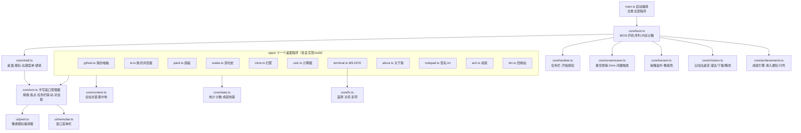

<div align="center">

# 💾 云端1998（Cloud 1998）

**一台跑在浏览器里的 1998 年中文复古电脑 —— 打开网站就是开机**

*Win98 拟物 · 零 UI 框架 · 零运行时依赖 · 应用约 102KB，两张风景壁纸 + 一只会溜达的鸡 + 一张 1998 年的内联网*

[](https://vitejs.dev/)
[](https://www.typescriptlang.org/)
[](./package.json)
[](./dist)
[](#-架构总览)

[功能全景](#-功能全景) · [架构总览](#-架构总览) · [技术亮点](#-核心技术亮点) · [快速开始](#-快速开始) · [项目结构](#-项目结构)

</div>

---

> 它不是"仿 Win98 风格的网页"，而是把整个桌面环境当应用写：
> 窗口管理、任务栏、开机序列、屏幕保护全部手写实现，一个 UI 框架都不引。
> 云朵闪电徽标、WeatherCore 的天气基因、Cloudflare 云端托管，云字一线三穿。

## ✨ 功能全景

打开网站即进入 BIOS 开机序列（回访自动快进），开机约 1 秒后**云咕咕**从屏幕左缘踱步入场，随后是完整的 Win98 中文桌面：

| 程序 | 说明 |
|---|---|
| 🐔 **云咕咕** | 星露谷原版像素鸡常驻桌面：溜达、啄食、下蛋、闲置久了趴睡 Zzz；拎起来扑翅挣扎、松手掉回地面、**甩快一点能把它踢飞**（撞墙反弹 + 满天羽毛 + 晕星星）；右键可喂食（撒谷粒看它小跑去啄）、查**属性**（蛋数/陪伴天数/随事件变化的心情）、**孵蛋**、静音、再见；蛋落地后 8 秒倒计时——手快点归你收集计数（第 10 颗有彩蛋台词），手慢了破壳出一只跟屁虫小鸡（上限 2 只，排队跟妈妈走）；被放生后在 MS-DOS 输入 `chicken` 召回 |
| 🖥️ **我的电脑** | 实时拉取 GitHub 公开数据（仓库数、关注者、最近仓库），sessionStorage 缓存 5 分钟 |
| 🪪 **关于我** | 个人介绍卡，文案集中在 `src/core/content.ts` |
| 📁 **我的文档** | 作品集文件夹：精选项目列表，双击开详情（像素占位图 + 中文介绍 + 技术栈标签 + 实时星数/语言）。想加项目就在 `content.ts` 的 `PROJECTS` 数组里加一条 |
| 🌐 **我的浏览器** | 一张住在这台电脑里的 1998 年内联网，**零真实联网**：云端导航（翻牌访客计数器）、WeatherCore 的个人主页（跑马灯 / 施工中 / 您是第 N 位贵客）、可留言的云端留言板（localStorage 保存，预置六条 1998 年网友灌水）；地址栏乱输外部网址，会得到一场 56K 拨号挣扎和「没有调制解调器」的经典报错页 |
| 🎨 **画板** | 画笔 / 橡皮 / Win98 十六色，点「重力」让整幅画坠落堆积（手写粒子物理） |
| 🐍 **贪吃蛇** | 方向键 / WASD / 触屏滑动，最高分本地保存 |
| 💣 **扫雷** | 初级 / 中级 / 高级三级固定难度：首点安全、笑脸按钮、LED 计时与最快纪录、数字上双击弦奏、问号标记、触屏长按插旗、F2 新局；窗口角落据说有一个从不说谎的像素 |
| 🧮 **计算器** | Win98 标准型全套：退格 / CE / C / √ / % / 1/x / ±、完整键盘输入；**显示屏即算式**——敲 `5` 显 `5`、敲 `+` 显 `5 +`，所见即所敲；数字键下面埋了几个笑话，先从除以零试起 |
| 🏆 **成就** | Steam 式成就系统：**25 个成就**（其中 12 个隐藏，未解锁显示 ？？？）；解锁瞬间右下角浮雕小窗滑入 + WebAudio 合成「叮-咚」；老玩家的历史战绩启动时自动补发（附一条摘要弹窗）；桌面「成就」程序查看进度格、解锁时间，内置音效开关；终端 `ach` 直达 |
| ⌨️ **MS-DOS 方式** | 可输入命令的终端，先试 `help`，再试试没写出来的命令 |
| 📄 **签名.txt** | 记事本收藏的 20 条励志签名，也是屏幕保护的磷光字幕 |
| 🗑️ **回收站** | 有一份「前任代码」，双击观赏，可清空 |

<details><summary><b>🥚 彩蛋清单（点击展开）</b></summary>

- 终端输入 `sudo rm -rf /` 触发蓝屏重启
- 科乐美秘籍（方向键 `↑↑↓↓←→←→BA`）触发像素雨
- 桌面右键换壁纸：内建「草原 / 湖光」锁定不可删，「更换壁纸...」打开显示属性，可上传自定义壁纸并自己命名（IndexedDB 本地保存，最多 8 张，可删除）
- 闲置 2 分钟进入「1998 CRT 之梦」屏幕保护（WebGL 星空引擎，详见架构章节）——云咕咕会浮在星空之上继续溜达
- 云咕咕闲置 90 秒趴下睡觉冒 Zzz；点击它咕咕叫冒爱心；喂食后下蛋更快
- 蛋落地 8 秒会自己破壳成小鸡（跟妈妈排队走，上限 2 只）——想收集计数就手快点
- 隐藏操作：拎起云咕咕快速甩动松手 = 把它踢飞（抛物线 + 撞墙反弹 + 晕星星 + 满天羽毛）
- 终端隐藏命令：`chicken`（召回/回应）、`chicken feed`（撒谷粒）、`chicken bye`（放生）、`chicken info`（查属性）、`stars`（手动点火星空引擎）、`xyzzy`（什么也没有发生……真的吗？）
- 扫雷里用键盘直接敲 `xyzzy`——窗口左上角出现一个像素，悬到雷上会变色（1992 年祖传秘籍，原汁原味）
- 计算器：除以零会收到宇宙的拒绝信；输入 `5318008` 后把窗口倒过来看看；连按十次 `=`，计算器开始怀疑人生
- 我的浏览器：地址栏输任何外部网址（比如 `www.baidu.com`）→ 56K 拨号 → 「没有调制解调器」；云端导航的角落里藏着「搜一搜」和「1998 新闻中心」；搜一搜里搜「彩蛋」有探测器报数；个人主页的「背景音乐」按钮是个关于 1998 年声卡物价的冷笑话；留言板真的能留言（存在 localStorage）
- 终端新增 `mine` / `calc` / `ie` / `ach` 直接开程序——`ie` 会假装拨号 163
- 成就系统：25 个成就、12 个隐藏——彩蛋基本都对应一个「？？？」，探索即点亮；老玩家启动自动补发
- 任务栏托盘：「中/EN」徽标可以点着玩；音量喇叭就是全局静音开关（连成就叮咚一起静）；点时钟弹出本月日历，今天高亮
- 开机内存计数到 65536K OK——当然可以点击跳过

</details>

## 🏗️ 架构总览



启动链路：`main.ts` 注册程序 → `boot.ts` 播放开机序列 → 依次初始化桌面、任务栏、屏保、秘籍、云咕咕。每个桌面程序实现统一的 `AppDef.build(ctx)` 契约（`core/types.ts`），由窗口管理器统一创建窗口、挂菜单栏、接任务栏——**加一个新程序只需写一个文件、注册一行**。

## 🔍 核心技术亮点

- 🐔 **云咕咕桌宠** — `src/core/chicken.ts`（1176 行）：星露谷原版贴图集渲染，**换父节点换层**实现一只鸡两种身份（平时挂 #desktop 在窗口之下，被拎起或屏保激活时挂 body 浮到星空之上）；十三态状态机（进场/溜达/啄食/进食/下蛋/睡眠/挣扎/坠落/踢飞/晕眩…）全部 JS 驱动、不吃 prefers-reduced-motion 的 CSS 冻结；蛋 8 秒倒计时竞速（收集 vs 破壳）、小鸡跟随队列、甩手速度判定踢飞抛物线（四边反弹）；鸡叫由 WebAudio 现场合成，**零音频文件**；鼠标事件兜底适配不派发 pointer 事件的内嵌浏览器
- 🪟 **手写窗口管理器** — `src/core/wm.ts`（490 行）：拖拽用 Pointer Capture + 边界 clamp、**八向缩放手柄**（四边 + 四角，左上双向锚住右下角反推位置，标题栏永不离屏）、双击标题栏最大化/还原、焦点 z-index 单调递增、最大化前记忆还原位置、任务栏按钮三态切换（最小化→还原 / 聚焦→最小化 / 失焦→聚焦）、`confirmBox()` 返回 Promise——没有 React，全靠 DOM
- 🔊 **全合成音效** — `src/core/sound.ts`：窗口开合的木质「嗒」、弹窗「叮」、开机 C 大调和弦、成就「叮-咚」，全部 WebAudio 现场合成（零音频文件）；任务栏音量图标与成就窗口共用一个静音开关；首次访问若从未点击过页面，浏览器会拦音频——静默失败不扫兴
- 🌐 **仿真内联网** — `src/apps/ie.ts`（572 行）：浏览器壳（工具栏/地址栏/状态栏/前进后退历史栈）+ 五张纯 DOM 手搓网页（云端导航 / 个人主页 / 留言板 / 搜一搜 / 新闻中心），跑马灯、闪烁、翻牌计数器全 CSS 复刻；地址栏解析支持中文别名，外部网址走「56K 拨号 → 无调制解调器」的完整心理曲线；留言 localStorage 持久化，悬停链接状态栏显示假 URL——**零真实联网，整个互联网住在本机里**
- 💣 **原味扫雷** — `src/apps/mine.ts`（424 行）：首点 3×3 安全布雷、flood fill 翻开、弦奏、旗/问号循环、LED 计数器、每级最快纪录、触屏长按插旗，外加祖传 `xyzzy` 秘籍——一个会随雷变色的像素
- 🏆 **成就系统地基** — `src/core/stats.ts` + `src/core/achievements.ts`：全站计数器统一埋点（`egg.*` 前缀一键枚举彩蛋），成就引擎订阅计数变化做规则判定，解锁走 Steam 式右下角滑入通知（Win98 浮雕皮 + 像素图标）+ WebAudio 现场合成的「叮-咚」（A5→E6 纯五度上扬，零音频文件）；老玩家启动时静默补发再弹一条摘要；**今后加成就只需三步**——`content.ts` 加定义、`RULES` 加判定、程序里埋一个 `stats.bump`，引擎零改动
- 🎨 **像素图标编译器** — `src/ui/pixel.ts`：图标以 16x16 字符画稿 + 18 色调色板定义，运行时逐行扫描并把连续同色像素合并为单个 `<rect>`，编译成 `shape-rendering="crispEdges"` 的 SVG data URL。**图标零图片文件，任意缩放不糊**
- 🍎 **重力粒子彩蛋** — `src/apps/paint.ts`：`getImageData` 按 3px 步长采样非白像素，欧拉积分（每帧重力 +0.5、落地反弹衰减 0.55）让画作坠落堆积；三重性能护栏——粒子睡眠计数、3800 粒子随机抽样上限、12 秒超时自动停
- 📡 **零后端活数据** — `src/apps/github.ts`：`Promise.all` 并行拉取用户与仓库，sessionStorage 缓存 5 分钟对抗 API 限流（60 次/小时），`AbortController` 取消旧请求防竞态，失败时给出 Win98 风格错误提示与重试按钮
- 🌌 **星空引擎** — `src/core/starfield-gl.ts` + `src/core/screensaver.ts`：手写 WebGL2 + GLSL，全部画面生成于一个全屏三角形的 fragment shader——域扭曲 FBM 暖锈色星云、冷白跃迁星流（每颗星一条真实运动模糊线段）、圆心目标辉光、CRT 玻璃曲率/扫描线/磷光呼吸/偶发电压波动；励志签名以琥珀磷光 VT323 像素字打字机浮现；退出时 CRT 通电闪，终端 `stars` 手动呼出的会话附赠 WebAudio 合成消磁「啵」；7 秒缓入 + 38 秒一周期的跃迁呼吸编排；性能自护栏（DPR ≤ 2、帧率过低先降星数再降内部分辨率）；WebGL 不可用时降级回原版 Canvas 2D 星空 + DVD 弹跳签名
- ♿ **无障碍与自适应** — 尊重系统「减少动态」设置：开机快进、屏保与像素雨自动禁用；手机自动切换全屏应用模式（窗口占满屏幕、图标变网格、单击打开）；回访者开机动画快进（localStorage 标记）

## 🛠️ 技术栈

| 层 | 技术 | 说明 |
|---|---|---|
| 构建 | Vite 5.4 + TypeScript 5.5 | 仅 devDependencies，两个包 |
| UI | 原生 DOM + CSS | 手写窗口系统，无 React / Vue |
| 图标 | 自研像素编译器 | 字符画稿 → SVG，图标零图片文件 |
| 桌宠 | 星露谷原版贴图集 | `public/sprites/gugu.png`（21KB，四种鸡 × 28 帧全动作） |
| 壁纸 | 风景 WebP + IndexedDB | 内建两张锁定；用户壁纸压缩后本地增删 |
| 字体 | 系统宋体 + 自托管 VT323 | 界面零字体加载；终端字体仅 7.9KB |
| 数据 | GitHub REST API | sessionStorage 缓存，零后端零数据库 |
| 部署 | Cloudflare Pages | 静态托管，推送即部署 |

## 🚀 快速开始

**0️⃣ 环境要求**

| 组件 | 版本 | 说明 |
|---|---|---|
| Node.js | ≥ 18 | Vite 5 的最低要求 |
| npm | ≥ 9 | 随 Node 附带 |

**1️⃣ 安装依赖**（只有 devDependencies，秒装）

```bash
npm install
```

**2️⃣ 启动开发服务器**

```bash
npm run dev
```

打开 http://localhost:5173 ，等一次完整的开机序列。

**3️⃣ 构建产物**

```bash
npm run build
```

先 `tsc --noEmit` 类型检查再打包，产出 `dist/` 约 820KB：应用约 102KB，两张 1920 宽风景壁纸（草原 Bliss 237KB、湖光 421KB），外加云咕咕的贴图集 21KB。

**4️⃣ 本地预览构建产物**

```bash
npm run preview
```

**5️⃣ 体验核心链路**

1. 等开机 → 看云咕咕从屏幕左缘走进来，点它一下、拎起来再松手
2. 双击「我的电脑」看 GitHub 活数据
3. 打开「MS-DOS 方式」→ 输入 `help` → 再输入 `sudo rm -rf /`
4. 打开「画板」画两笔 → 点「重力」
5. 按方向键 `↑↑↓↓←→←→BA` → 欣赏像素雨
6. 右键云咕咕「喂食」，看它小跑去啄谷粒；等蛋落地数 8 秒——收集计数还是让它破壳抱娃，你选；拎起它快速甩一下再松手，踢飞解压；什么都不动等 2 分钟 → CRT 之梦星空里它还在溜达（等不及就开终端输入 `stars`）
7. 打开「我的浏览器」逛逛内联网：云端导航 → 个人主页 → 留言板踩一脚；再在地址栏输个 `www.baidu.com`，感受 56K 猫的挣扎
8. 「扫雷」开一局（F2 重开，三级难度在「游戏」菜单）；「计算器」除以零试试
9. 打开「成就」看进度格——每个「？？？」都是一个还没被你发现的彩蛋；解锁瞬间留意右下角和那声「叮-咚」
10. 拖住窗口边框或四角缩放大小、双击标题栏最大化；点托盘喇叭静音、点时钟看本月日历

## ☁️ 部署到 Cloudflare Pages（免费）

1. 在 GitHub 新建仓库（比如 `weathercore-desktop`），把项目推上去：

   ```bash
   git init
   git add .
   git commit -m "WeatherCore 98 上线"
   git remote add origin https://github.com/<你的用户名>/weathercore-desktop.git
   git push -u origin main
   ```

2. 打开 [Cloudflare Dashboard](https://dash.cloudflare.com/) → **Workers 和 Pages** → **创建** → **Pages** 标签页 → **连接到 Git**，选中刚推的仓库。

3. 构建配置（一般会自动识别，不对就手动填）：

   | 配置项 | 值 |
   |---|---|
   | 框架预设 | `Vite`（或无） |
   | 构建命令 | `npm run build` |
   | 构建输出目录 | `dist` |

4. 点 **保存并部署**，一分钟后拿到 `xxx.pages.dev` 域名。之后每次 `git push` 自动重新部署；自定义域名随时可在「自定义域」里绑定，不影响现有部署。

## ✏️ 想改网站上的字？

所有文案集中在 `src/core/content.ts`：网名、关于我、励志签名、开机文案、终端命令、彩蛋台词，改完 `git push` 即自动上线。改完重新部署前可先 `npm run dev` 本地核对。

## 📁 项目结构

```
.
├── index.html              # 唯一 HTML 入口
├── vite.config.ts          # Vite 配置（零插件）
├── public/
│   ├── favicon.svg
│   ├── sprites/gugu.png    # 云咕咕贴图集（四种鸡 × 28 帧）
│   └── wallpapers/         # 草原 / 湖光两张壁纸
└── src/
    ├── main.ts             # 启动编排：注册程序 → 开机 → 桌面 + 云咕咕
    ├── styles/             # global / win98 / apps / gugu 四套样式 + 自托管字体
    ├── core/               # 桌面内核
    │   ├── wm.ts           # ★ 手写窗口管理器（358 行）
    │   ├── chicken.ts      # ★ 云咕咕桌宠（状态机 / 图层 / 音效 / 蛋 / 谷粒）
    │   ├── boot.ts         # BIOS 开机序列 + 内存计数
    │   ├── shell.ts        # 桌面图标 / 右键菜单 / 壁纸 / 气泡通知
    │   ├── taskbar.ts      # 任务栏 / 开始按钮
    │   ├── screensaver.ts  # 星空屏保编排（GL 主路径 + 2D 降级 + CRT 退场闪）
    │   ├── starfield-gl.ts # WebGL2/GLSL 星空引擎（星云·跃迁·CRT 质感）
    │   ├── konami.ts       # 科乐美秘籍 → 像素雨
    │   ├── fx.ts           # 蓝屏 / 关机 / 彩带特效
    │   ├── stats.ts        # ★ 统计计数（成就的数据源，egg.* 彩蛋埋点）
    │   ├── achievements.ts # ★ 成就引擎（规则判定 / 滑入通知 / 叮咚 / 补发）
    │   ├── sound.ts        # ★ 全合成音效（嗒/叮/开机和弦，统一静音）
    │   ├── content.ts      # ★ 全站文案（改这里换内容）
    │   ├── types.ts        # AppDef / AppCtx 应用契约
    │   └── util.ts         # el / clamp / isMobile / reducedMotion
    ├── apps/               # 十一个桌面程序
    │   ├── index.ts        # 程序注册表 APPS
    │   ├── github.ts       # 我的电脑（GitHub 活数据）
    │   ├── ie.ts           # 我的浏览器（仿真内联网：五张手搓网页）
    │   ├── paint.ts        # 画板（含重力物理彩蛋）
    │   ├── snake.ts        # 贪吃蛇
    │   ├── mine.ts         # 扫雷（含 xyzzy 祖传秘籍）
    │   ├── calc.ts         # 计算器（标准型 + 三个彩蛋）
    │   ├── terminal.ts     # MS-DOS 终端（含 chicken 命令）
    │   ├── ach.ts          # 成就（进度格 / 隐藏 ??? / 音效开关）
    │   ├── about.ts        # 关于我
    │   ├── notepad.ts      # 签名.txt
    │   └── bin.ts          # 回收站
    └── ui/                 # UI 基建
        ├── pixel.ts        # ★ 16x16 像素画稿 → SVG 编译器
        └── menubar.ts      # 窗口菜单栏
```

<details><summary><b>📊 工程规模</b>（点击展开）</summary>

- TypeScript 源文件 34 个，最大单文件 `chicken.ts` 1176 行（桌宠全家桶：状态机/小鸡/踢飞/心情）、其次 `ie.ts` 572 行（仿真内联网五张网页）、`mine.ts` 424 行（扫雷）、`wm.ts` 490 行
- 依赖边集中在 `core/types.ts`（入度 10）：所有程序只依赖统一契约，互不感知
- 快速上手三文件：`apps/about.ts`（最简程序样板）→ `core/types.ts`（契约）→ `core/wm.ts`（内核）

</details>

---

<div align="center">

**如果这台 1998 年的电脑让你想起了什么，点个 ⭐ Star 吧**

觉得好玩可以 Fork 一台自己的——记得改 `content.ts`。

</div>
